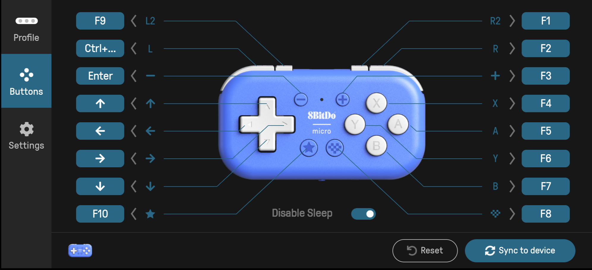

# Gemma Vision  

AI assistant for the blind. Built around Gemma 4 LiteRT-LM, OCR-assisted camera flows, and a voice-first interface.  

## Features  

- **8BitDo controller support** for hands-free operation  
- **Offline AI processing** after initial model download  
- **Complete privacy** — nothing leaves your device  
- **Text reading** through on-device OCR and Gemma 4 reasoning  
- **Ask follow-up questions** — Gemma remembers previous chat context  
- **Screen reader optimized** for VoiceOver and TalkBack  

## Download  

Get the latest APK from [Releases](../../releases)  

## Setup  

1. Install APK  
2. Download AI model (~3 GB)  
3. Grant camera & mic permissions  
4. Connect an 8BitDo controller in Keyboard Mode, then open the **8BitDo Ultimate Software** app and map your buttons as shown below:  
     
5. Go into settings in the app to learn more about what each button on the controller does  
6. It is recommended to switch off VoiceOver/TalkBack when using the controller  

<p align="center"><a href="https://gemmavision.com/"><b>Learn more at gemmavision.com</b></a></p>  

## Development  

```bash
git clone https://github.com/TGTech06/gemma-vision.git
cd gemma-vision
flutter pub get
flutter run
```
---
<p align="center"><i>Made with ❤️ for my brother Matteo and the blind community.<br>
